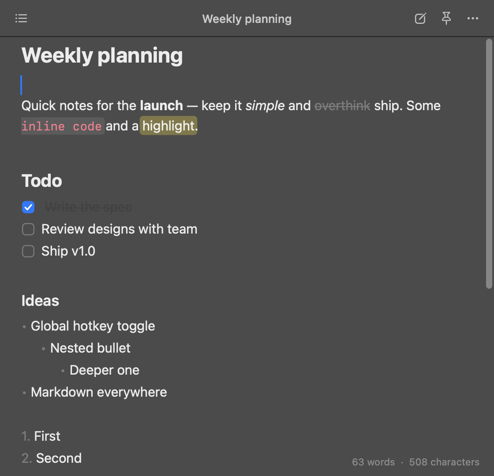
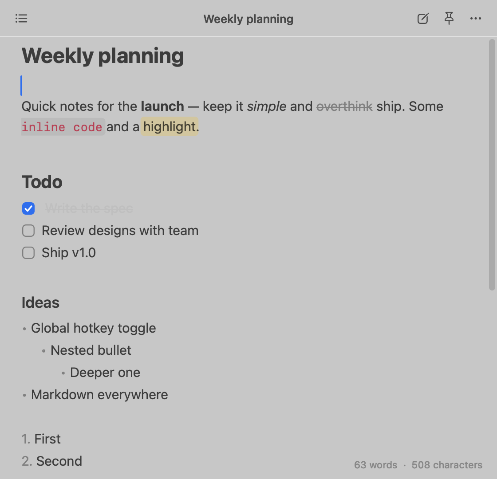
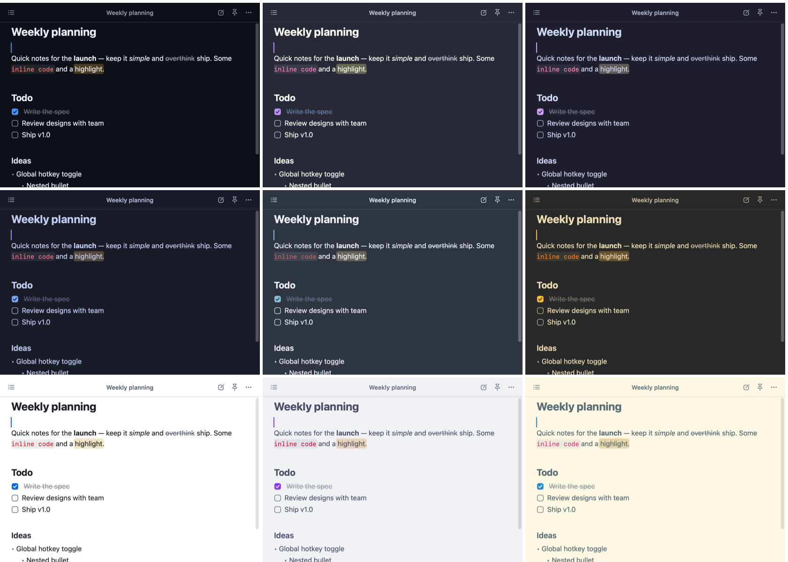

# Mini Notes

A tiny, native macOS clone of **Raycast Notes**: one floating notes window you summon with a global hotkey, with live markdown that looks like rich text.

Written in Swift with AppKit + TextKit — no Electron, no web view. ~600 KB, launches instantly, toggles in a frame.

<p align="center">
  
  
</p>

## Features

- **Global hotkey** (default <kbd>⌥</kbd><kbd>⌘</kbd><kbd>N</kbd>) toggles the window from anywhere; <kbd>Esc</kbd> hides it and returns you to the app you were in
- **Live markdown** — headings, **bold**, _italic_, ~~strikethrough~~, ==highlight==, `inline code`, fenced code blocks, links, quotes, rules, nested bullets, numbered lists and clickable checkboxes. Syntax hides itself except on the line you're editing
- **Smart editing** — lists continue on <kbd>Enter</kbd>, <kbd>Tab</kbd> / <kbd>⇧Tab</kbd> nest them, `[] ` becomes a checkbox, <kbd>Backspace</kbd> after a marker removes it
- **Quick switcher** (<kbd>⌘P</kbd>) with full-text search, and an **actions palette** (<kbd>⌘K</kbd>)
- **Themes** — 18 popular editor themes (GitHub, VS Code, One Dark, Dracula, Catppuccin, Tokyo Night, Nord, Gruvbox, Solarized, Rosé Pine…) with live preview, plus auto light/dark pairs
- **iCloud sync** — one checkbox moves your notes to iCloud Drive; edits from your other Macs show up live
- **Plain files** — every note is a `.md` file you own; deleted notes go to the Trash
- Float on top, light/dark mode, menu bar icon, open at login, adjustable text size

## Install

Requires **macOS 14 Sonoma or later** (Apple Silicon or Intel).

### Download

1. Download **[MiniNotes.zip](https://github.com/stefansdev/mini-notes/releases/latest/download/MiniNotes.zip)** from the [latest release](https://github.com/stefansdev/mini-notes/releases/latest).
2. Unzip it and drag **Mini Notes.app** into **Applications**.
3. Open it. Because the app isn't notarized by Apple, macOS will block the first launch — go to **System Settings → Privacy & Security**, scroll down and click **Open Anyway**.

Or do it all from Terminal (skips the Gatekeeper prompt):

```bash
curl -fsSL https://github.com/stefansdev/mini-notes/releases/latest/download/MiniNotes.zip -o /tmp/MiniNotes.zip \
  && ditto -x -k /tmp/MiniNotes.zip /Applications \
  && xattr -dr com.apple.quarantine "/Applications/Mini Notes.app" \
  && open "/Applications/Mini Notes.app"
```

### Build from source

Needs Xcode 15+ (or the Swift 5.9+ toolchain).

```bash
git clone https://github.com/stefansdev/mini-notes.git
cd mini-notes
./build.sh install   # builds, copies to /Applications and launches
```

## Usage

Mini Notes lives in the menu bar (no Dock icon). Press the hotkey to show or hide the window, and start typing. Change the hotkey and other options in **Settings** (<kbd>⌘,</kbd> or the menu bar icon).

### Shortcuts

| Notes | | Formatting | |
|---|---|---|---|
| Toggle window | <kbd>⌥⌘N</kbd> (global) | Bold / Italic | <kbd>⌘B</kbd> / <kbd>⌘I</kbd> |
| Hide | <kbd>Esc</kbd> / <kbd>⌘W</kbd> | Strikethrough | <kbd>⇧⌘X</kbd> |
| New note | <kbd>⌘N</kbd> | Highlight | <kbd>⇧⌘H</kbd> |
| Browse / search notes | <kbd>⌘P</kbd> | Inline code / code block | <kbd>⌘E</kbd> / <kbd>⌥⌘C</kbd> |
| Actions | <kbd>⌘K</kbd> | Link | <kbd>⌘L</kbd> |
| Previous / next note | <kbd>⌘[</kbd> / <kbd>⌘]</kbd> | Heading 1–3 | <kbd>⌥⌘1</kbd>–<kbd>3</kbd> |
| Duplicate | <kbd>⌘D</kbd> | Numbered / bulleted / checklist | <kbd>⇧⌘7</kbd> / <kbd>8</kbd> / <kbd>9</kbd> |
| Copy as markdown | <kbd>⇧⌘C</kbd> | Toggle checkbox | <kbd>⌘↩</kbd> or click it |
| Export | <kbd>⇧⌘E</kbd> | Blockquote | <kbd>⇧⌘B</kbd> |
| Delete (to Trash) | <kbd>⇧⌘⌫</kbd> | Indent / outdent list | <kbd>Tab</kbd> / <kbd>⇧Tab</kbd> |
| Change theme | <kbd>⌥⌘T</kbd> | | |
| Float on top | <kbd>⇧⌘F</kbd> | Text size | <kbd>⌘+</kbd> / <kbd>⌘−</kbd> / <kbd>⌘0</kbd> |
| Find | <kbd>⌘F</kbd> | Open link | <kbd>⌘</kbd>-click |

## Themes

Press <kbd>⌥⌘T</kbd> (or <kbd>⌘K</kbd> → *Change Theme…*) and arrow through the list — the window previews each theme live; <kbd>Enter</kbd> keeps it, <kbd>Esc</kbd> reverts. You can also pick one in Settings.

<p align="center"></p>

| | Themes |
|---|---|
| **Default** | System (translucent, follows macOS) |
| **Auto light/dark** | VS Code, GitHub, One, Catppuccin, Gruvbox, Solarized, Rosé Pine |
| **Dark** | VS Code Dark Modern, GitHub Dark, One Dark Pro, Dracula, Monokai, Nord, Tokyo Night, Catppuccin Mocha, Gruvbox Dark, Solarized Dark, Rosé Pine |
| **Light** | VS Code Light Modern, GitHub Light, One Light, Catppuccin Latte, Gruvbox Light, Solarized Light, Rosé Pine Dawn |

"Auto" themes switch between their light and dark variant with macOS. Themes live in [`Theme.swift`](Sources/MiniNotes/Theme.swift) as ten colors each — adding one is a single `ThemeSpec` entry.

## Storage & sync

Notes are plain markdown files in `~/Library/Application Support/Mini Notes/Notes`.

To sync between Macs, tick **Sync notes with iCloud Drive** in Settings on each Mac. Notes move to `iCloud Drive › Mini Notes` (also visible in the Files app on iPhone), and changes from other devices appear live — unsaved edits on the current Mac always win. If the same note is edited on two offline Macs, iCloud keeps both copies and the second shows up as its own note. You can also point the app at any folder with **Change…**.

## Development

```bash
swift build                    # debug build
.build/debug/MiniNotes         # run it
```

Project layout:

```
Sources/MiniNotes/
  Markdown/MarkdownStyler.swift         # live markdown → attributes (incremental)
  Markdown/MarkdownLayoutManager.swift  # hidden syntax, bullets, checkboxes, code/quote drawing
  Editor/NoteTextView.swift             # list continuation, shortcuts, formatting commands
  UI/                                   # window, header, ⌘P/⌘K palette, settings
  Theme.swift                           # theme definitions + ThemeManager
  NotesStore.swift                      # .md files, debounced saves, folder watching / iCloud
  HotKey.swift                          # global hotkey (Carbon, no Accessibility permission)
```

Debug builds include test hooks:

```bash
MININOTES_SNAPSHOT=/dev/null MININOTES_ACTION=selftest .build/debug/MiniNotes   # editor behaviour tests
MININOTES_SNAPSHOT=/dev/null MININOTES_ACTION=themetest .build/debug/MiniNotes  # theme preview/revert tests
MININOTES_SNAPSHOT=/tmp/shot.png MININOTES_APPEARANCE=dark .build/debug/MiniNotes  # render window to PNG
```

`./build.sh dist` produces the universal `build/MiniNotes.zip` attached to releases.

## License

[MIT](LICENSE). Not affiliated with Raycast.
